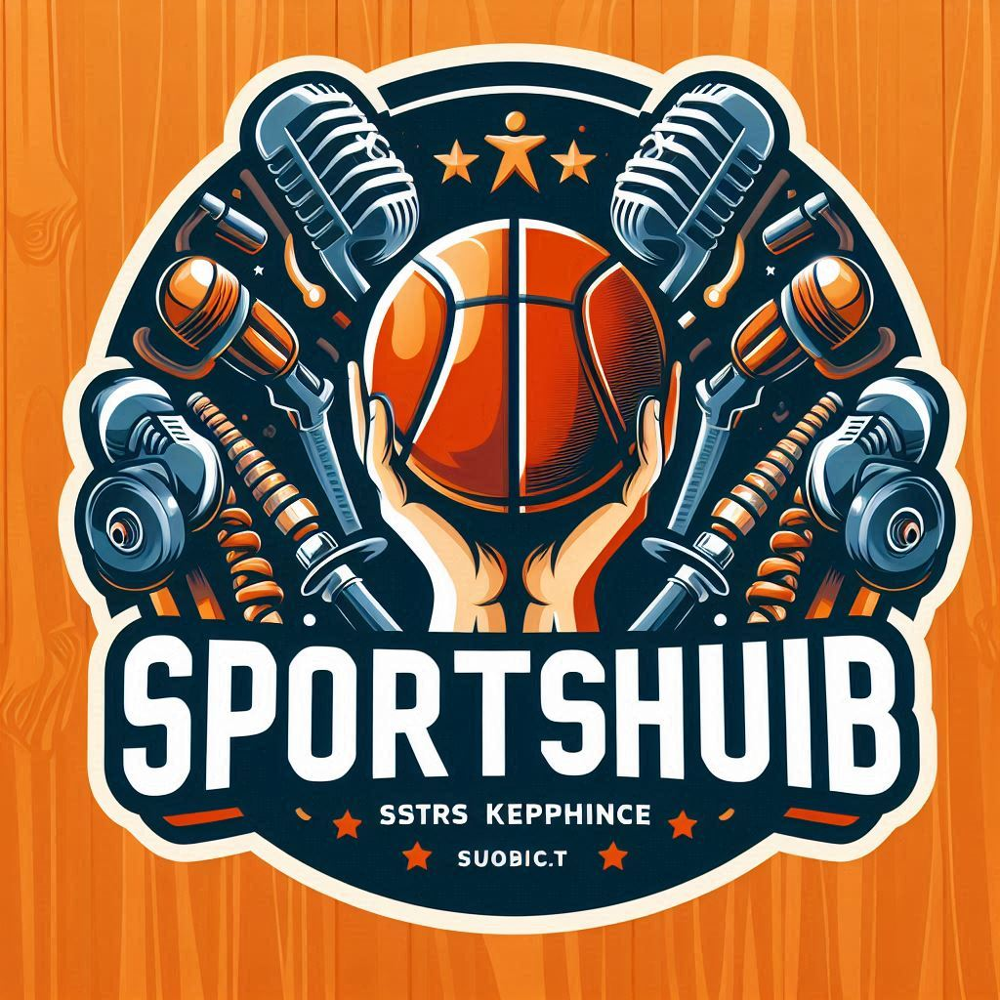

# 🏆 EquiSports - Premium Sports Equipment Store


## 🎯 Overview
EquiSports is a premium online store offering a wide range of high-quality sports equipment for various sports and activities. It provides a seamless shopping experience with secure authentication, equipment management features, and a modern user interface.



## 🎯 Live Site
[Visit Sports Hub](https://sports-equipment-online-cb91b.web.app)

## ✨ Key Features

- 🔐 **Secure Authentication**: Multiple login options including email/password and Google authentication
- 🛍️ **Equipment Management**: Users can add, update, and delete their sports equipment listings
- 🌓 **Dark/Light Theme**: Toggle between dark and light modes for comfortable viewing
- 📱 **Fully Responsive**: Seamless experience across mobile, tablet, and desktop devices
- ⚡ **Real-time Updates**: Instant feedback with toast notifications for all user actions
- 🎨 **Modern UI**: Sleek design with animations using React Awesome Reveal and Lottie React
- 💻 **User Dashboard**: Personal equipment management interface for registered users
- 🔍 **Advanced Sorting**: Price-based sorting functionality for equipment listings

## 🛠️ Technologies Used

### Frontend
- React.js with Vite
- Tailwind CSS & DaisyUI
- Firebase Authentication
- React Router DOM
- Axios
- React Hot Toast
- React Awesome Reveal
- React Tooltip
- Lottie React

### Backend
- Node.js
- Express.js
- MongoDB
- Mongoose
- CORS
- dotenv

## 📦 Dependencies

- "axios": "^1.7.9",
- "firebase": "^11.0.2",
- "lottie-react": "^2.4.0",
- "lucide-react": "^0.468.0",
- "react": "^18.2.0",
- "react-awesome-reveal": "^4.2.14",
- "react-dom": "^18.2.0",
- "react-hot-toast": "^2.4.1",
- "react-icons": "^5.4.0",
- "react-router-dom": "^7.0.2",
- "react-tooltip": "^5.28.0"
- "@vitejs/plugin-react": "^4.0.0",
- "autoprefixer": "^10.4.20",
- "daisyui": "^4.12.14",
- "postcss": "^8.4.49",
- "tailwindcss": "^3.4.16",
- "vite": "^6.0.1"

## 🚀 How to Run the Project Locally

1. **Clone the repository:**
   ```bash
   git clone [repository link]
   cd equisports-client
